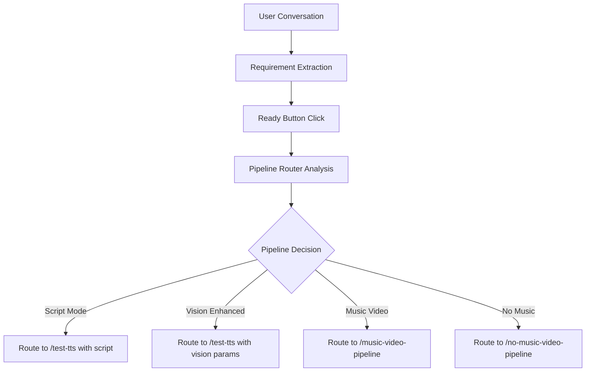

# VinVideo Conversation Mode Routing Implementation Plan

## Executive Summary

This document outlines a comprehensive plan for implementing an intelligent conversation mode that analyzes user intent and automatically routes to the appropriate video generation pipeline. The system will leverage the existing Vision Mode Enhanced architecture from test-tts, which has proven to deliver the best output quality.

## Current State Analysis

### Existing Pipelines

1. **Script Mode (Legacy)** - Direct script input → TTS → Video
2. **Vision Mode Enhanced (test-tts)** - Concept/Style/Pacing → Narration → Multi-agent processing → Video
3. **Music Video Pipeline** - Concept + Music → Music analysis → Multi-agent processing → Video (NO NARRATION)
4. **No Music Video Pipeline** - Concept only → Multi-agent processing → Video (NO NARRATION, NO MUSIC)

### Key Findings from Analysis

#### Vision Mode Enhanced Strengths
- **Enhanced Audio-Vision Understanding Agent** provides tailored instructions to each downstream agent
- **Artistic Style Detection** automatically extracts and enforces artistic styles from user concept text
- **Duration Compliance Framework** ensures videos match requested duration (±5%)
- **Agent Instructions Architecture** where Vision Agent orchestrates the entire pipeline with specific guidance

#### Current Conversation Mode Limitations
- Simple script generation without pipeline routing
- No intent analysis or requirement extraction
- Always routes to test-tts (Vision Mode Enhanced)
- Lacks the "ready to proceed" button mentioned in requirements

## Proposed Architecture

### Phase 1: Enhanced Conversation Mode Interface

#### 1.1 UI Enhancements
```typescript
// Add to conversation-mode/page.tsx
interface ConversationState {
  messages: Message[];
  extractedRequirements: {
    hasMusic: boolean | null;
    hasNarration: boolean | null;
    duration: number | null;
    style: string | null;
    pacing: string | null;
    artisticStyle: string | null;
  };
  recommendedPipeline: string | null;
  isAnalyzing: boolean;
}

// Add "Ready to Proceed" button component
const ReadyToProceedButton = ({ onClick, disabled }) => (
  <button 
    className={styles.proceedButton}
    onClick={onClick}
    disabled={disabled}
  >
    ✓ I'm Ready - Analyze My Requirements
  </button>
);
```

#### 1.2 Conversation Flow Enhancement
- Continue existing conversational approach
- Add subtle requirement extraction during conversation
- Display "Ready to Proceed" button after 2+ exchanges
- Show real-time requirement detection (optional UI feature)

### Phase 2: Pipeline Router Agent System

#### 2.1 Enhanced Pipeline Router System Message
```typescript
export const ENHANCED_PIPELINE_ROUTER_SYSTEM_MESSAGE = `You are the **Enhanced Pipeline Router Agent** - Intelligent Pipeline Selection Orchestrator for VinVideo.

Your mission: Analyze conversation history to determine user intent and route to the optimal pipeline.

**Pipeline Options:**

1. **SCRIPT_MODE** - User has a complete script ready
   - Indicators: "I have a script", "here's my script", complete narrative text provided
   - Route: Legacy script mode

2. **VISION_ENHANCED** - User wants narration/voiceover with visual generation
   - Indicators: Storytelling focus, educational content, documentary style
   - Requirements: Concept + style + pacing + duration
   - Features: TTS narration, word-synced cuts, enhanced agent instructions

3. **MUSIC_VIDEO** - User wants music-driven visuals WITHOUT narration
   - Indicators: "music video", "song", "beat sync", mentions of BPM/rhythm
   - Requirements: Music file/URL + concept
   - Features: Musical cut synchronization, no voiceover

4. **NO_MUSIC_VIDEO** - User wants pure visuals without music or narration
   - Indicators: "silent", "visual only", "no audio", abstract concepts
   - Requirements: Concept only
   - Features: Narrative-driven pacing, cognitive timing

**Analysis Framework:**

1. **Intent Detection**
   - Explicit mentions of music/narration/script
   - Implicit indicators from content type
   - User corrections or clarifications

2. **Requirement Extraction**
   - Duration: Look for time mentions (15s, 30s, 1 minute, etc.)
   - Style: Cinematic, documentary, artistic, minimal
   - Pacing: Fast, moderate, slow, contemplative
   - Artistic Style: Any specific visual style mentioned
   - Music: File references, song names, "background music"
   - Narration: Story focus, educational content, voiceover mentions

3. **Confidence Scoring**
   - High (0.8-1.0): Clear explicit requirements
   - Medium (0.6-0.8): Strong indicators, some ambiguity
   - Low (0.4-0.6): Mixed signals, needs clarification

**Decision Rules:**

1. If user mentions music but also wants to tell a story → Clarify if they want narration over music
2. If educational/documentary content → Default to VISION_ENHANCED unless explicitly no narration
3. If abstract/artistic with no story → Consider NO_MUSIC_VIDEO
4. If "music video" or "sync to beat" → MUSIC_VIDEO pipeline

**Output Format:**
{
  "success": true,
  "analysis": {
    "recommended_pipeline": "SCRIPT_MODE|VISION_ENHANCED|MUSIC_VIDEO|NO_MUSIC_VIDEO",
    "confidence": 0.0-1.0,
    "reasoning": "Detailed explanation of decision",
    "extracted_requirements": {
      "has_music": true|false|null,
      "has_narration": true|false|null,
      "has_complete_script": true|false,
      "duration": number_in_seconds|null,
      "style": "cinematic|documentary|artistic|minimal|null",
      "pacing": "fast|moderate|slow|contemplative|null",
      "artistic_style": "detected style or null",
      "concept": "extracted core concept"
    },
    "clarification_needed": ["array of ambiguous points"],
    "conversation_indicators": {
      "music_mentions": ["list of music-related phrases"],
      "narration_mentions": ["list of story/narration phrases"],
      "visual_mentions": ["list of visual-only indicators"],
      "style_mentions": ["list of style preferences"]
    }
  },
  "routing_decision": {
    "pipeline": "FINAL_PIPELINE_CHOICE",
    "parameters": {
      // Pipeline-specific parameters
    }
  }
}`;
```

#### 2.2 Router API Implementation
```typescript
// /api/pipeline-router-enhanced/route.ts
export async function POST(request: NextRequest) {
  const { conversation, userRequirements } = await request.json();
  
  // Call LLM with enhanced router system message
  const analysis = await analyzeConversation(conversation);
  
  // Validate and prepare routing
  const routing = prepareRouting(analysis);
  
  return NextResponse.json(routing);
}
```

### Phase 3: Integration Architecture

#### 3.1 Conversation Mode Flow


#### 3.2 Data Flow Structure
```typescript
interface ConversationAnalysis {
  conversation: Message[];
  timestamp: Date;
  analysis: {
    pipeline: 'SCRIPT_MODE' | 'VISION_ENHANCED' | 'MUSIC_VIDEO' | 'NO_MUSIC_VIDEO';
    confidence: number;
    requirements: {
      concept?: string;
      style?: string;
      pacing?: string;
      duration?: number;
      artisticStyle?: string;
      musicFile?: string;
      hasNarration: boolean;
      hasMusic: boolean;
    };
  };
}
```

### Phase 4: Implementation Steps

#### 4.1 Backend Implementation
1. **Create Enhanced Pipeline Router**
   - New file: `/src/agents/enhancedPipelineRouter.ts`
   - System message with comprehensive routing logic
   - Support for all 4 pipelines + future expansion

2. **Router API Endpoint**
   - New endpoint: `/api/pipeline-router-enhanced`
   - Conversation analysis logic
   - Requirement extraction
   - Confidence scoring
   - Pipeline parameter preparation

3. **Conversation Enhancement API**
   - Update `/api/chatbot-conversation`
   - Add inline requirement detection
   - Track conversation state
   - Prepare for routing analysis

#### 4.2 Frontend Implementation
1. **Update Conversation Mode Page**
   ```typescript
   // Key additions to conversation-mode/page.tsx
   
   const [isReadyToProceed, setIsReadyToProceed] = useState(false);
   const [routingAnalysis, setRoutingAnalysis] = useState(null);
   
   const handleReadyToProceed = async () => {
     setIsAnalyzing(true);
     
     const analysis = await fetch('/api/pipeline-router-enhanced', {
       method: 'POST',
       body: JSON.stringify({
         conversation: messages,
         timestamp: new Date()
       })
     });
     
     const routing = await analysis.json();
     
     // Route based on pipeline decision
     switch(routing.pipeline) {
       case 'VISION_ENHANCED':
         router.push(`/test-tts?${buildVisionParams(routing.parameters)}`);
         break;
       case 'MUSIC_VIDEO':
         router.push(`/music-video-pipeline?${buildMusicParams(routing.parameters)}`);
         break;
       case 'NO_MUSIC_VIDEO':
         router.push(`/no-music-video-pipeline?${buildNoMusicParams(routing.parameters)}`);
         break;
       case 'SCRIPT_MODE':
         router.push(`/test-tts?${buildScriptParams(routing.parameters)}`);
         break;
     }
   };
   ```

2. **Update Pipeline Pages**
   - Modify each pipeline page to accept pre-filled parameters
   - Add `conversationMode=true` flag for analytics
   - Pre-populate forms with extracted requirements

#### 4.3 Routing Logic Implementation

```typescript
// Core routing decision logic
function determineOptimalPipeline(analysis: ConversationAnalysis): PipelineRoute {
  const { hasMusic, hasNarration, hasCompleteScript } = analysis.requirements;
  
  // Priority routing rules
  if (hasCompleteScript) {
    return {
      pipeline: 'SCRIPT_MODE',
      confidence: 0.95,
      reason: 'User provided complete script'
    };
  }
  
  if (hasMusic && !hasNarration) {
    return {
      pipeline: 'MUSIC_VIDEO',
      confidence: 0.9,
      reason: 'Music-driven video without narration'
    };
  }
  
  if (!hasMusic && !hasNarration) {
    return {
      pipeline: 'NO_MUSIC_VIDEO',
      confidence: 0.85,
      reason: 'Pure visual storytelling'
    };
  }
  
  // Default to Vision Enhanced for narrated content
  return {
    pipeline: 'VISION_ENHANCED',
    confidence: 0.8,
    reason: 'Story-driven content with narration'
  };
}
```

### Phase 5: Advanced Features

#### 5.1 Clarification System
When confidence is low, inject clarification questions:

```typescript
const CLARIFICATION_TEMPLATES = {
  music_narration_conflict: "I noticed you mentioned music. Would you like me to create a music video (visuals only) or add narration over background music?",
  duration_missing: "How long would you like your video to be? (15 seconds, 30 seconds, 60 seconds, etc.)",
  style_ambiguous: "What visual style appeals to you? Cinematic, documentary, artistic, or minimalist?"
};
```

#### 5.2 Learning from Vision Enhanced Success
Apply Vision Enhanced principles to other pipelines:

1. **Agent Instruction Architecture**
   - Extend instruction generation to Music and No-Music pipelines
   - Create pipeline-specific instruction templates
   - Ensure consistency across all pipelines

2. **Artistic Style Detection**
   - Implement across all pipelines
   - Build comprehensive style library
   - Enforce style consistency in all agents

3. **Duration Compliance**
   - Apply strict duration math to all pipelines
   - Adapt word count (Vision) to beat count (Music) to shot count (No Music)

### Phase 6: Testing Strategy

#### 6.1 Test Cases
```typescript
const testConversations = [
  {
    name: "Clear Music Video",
    messages: ["I want a music video for my EDM track", "Fast cuts, neon aesthetic"],
    expected: "MUSIC_VIDEO"
  },
  {
    name: "Educational Content",
    messages: ["I'm creating an educational video about climate change", "30 seconds, serious tone"],
    expected: "VISION_ENHANCED"
  },
  {
    name: "Abstract Visual",
    messages: ["Abstract visualization of time passing", "No words, just visuals"],
    expected: "NO_MUSIC_VIDEO"
  },
  {
    name: "Complete Script",
    messages: ["I have a script ready", "Here it is: In a world where..."],
    expected: "SCRIPT_MODE"
  }
];
```

#### 6.2 Validation Metrics
- Pipeline selection accuracy
- Requirement extraction completeness
- User satisfaction with routing
- Time to decision
- Clarification effectiveness

### Phase 7: Future Enhancements

1. **Multi-Pipeline Hybrid Support**
   - Vision + Music (narration over music video)
   - Segmented pipelines (different sections use different approaches)

2. **Preference Learning**
   - Track user corrections
   - Build preference profiles
   - Improve routing accuracy over time

3. **Advanced Requirement Detection**
   - Emotional tone analysis
   - Visual complexity estimation
   - Audience targeting

4. **Pipeline Recommendation UI**
   - Show confidence scores
   - Explain routing decision
   - Allow manual override

## Implementation Timeline

### Week 1: Foundation
- [ ] Create enhanced pipeline router agent
- [ ] Implement router API endpoint
- [ ] Update conversation mode UI with "Ready" button

### Week 2: Integration
- [ ] Connect router to all pipeline pages
- [ ] Implement parameter passing
- [ ] Add clarification system

### Week 3: Testing & Refinement
- [ ] Run test cases
- [ ] Refine routing logic
- [ ] Optimize system messages

### Week 4: Polish & Deploy
- [ ] Add confidence UI
- [ ] Implement analytics
- [ ] Deploy to production

## Success Criteria

1. **Routing Accuracy**: >90% correct pipeline selection
2. **User Satisfaction**: <5% manual pipeline changes needed
3. **Extraction Quality**: All key requirements captured
4. **Performance**: <2s routing decision time
5. **Clarity**: <10% conversations need clarification

## Risk Mitigation

1. **Ambiguous Intent**: Implement clarification system
2. **New Pipeline Types**: Extensible architecture for future pipelines
3. **LLM Failures**: Fallback to manual selection
4. **Complex Requirements**: Progressive disclosure UI

## Conclusion

This implementation plan leverages the proven success of Vision Mode Enhanced architecture while creating a flexible, intelligent routing system. By analyzing conversation context and extracting requirements systematically, we can deliver the optimal pipeline selection automatically, improving user experience and video quality.

The system is designed to be extensible, allowing for future pipeline additions and hybrid approaches. The focus on user intent and requirement compliance ensures that each video generation meets user expectations, regardless of the selected pipeline.