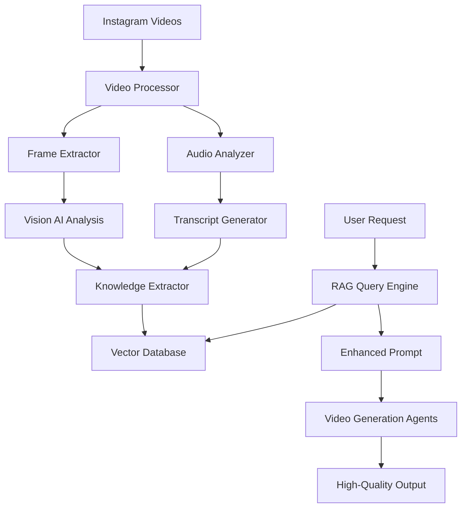

# Knowledge Extraction and RAG System for AI Video Generation Enhancement

## Table of Contents
1. [Project Overview](#project-overview)
2. [Technical Architecture](#technical-architecture)
3. [Video Processing Pipeline](#video-processing-pipeline)
4. [Data Structures](#data-structures)
5. [RAG Implementation](#rag-implementation)
6. [Agent Enhancement Strategy](#agent-enhancement-strategy)
7. [Implementation Timeline](#implementation-timeline)
8. [Code Examples](#code-examples)
9. [Quality Assurance](#quality-assurance)
10. [Cost Analysis](#cost-analysis)

## 1. Project Overview

### Problem Statement
Current AI video generation agents produce generic outputs that lack the nuanced understanding of real-world video creation techniques, visual aesthetics, and creative storytelling methods used by professional content creators.

### Solution
Implement a Knowledge Extraction and Retrieval-Augmented Generation (RAG) system that:
- Extracts knowledge from high-quality Instagram Reels and video tutorials
- Stores structured creative insights in a searchable knowledge base
- Enhances agent prompts with relevant examples during video generation
- Improves output quality by grounding AI decisions in real-world examples

### Key Benefits
- **Higher Quality Output**: Videos that match professional standards
- **Style Consistency**: Learn and replicate successful visual styles
- **Reduced Iterations**: Get it right the first time more often
- **Cost Efficiency**: Reduce failed generations and re-runs

## 2. Technical Architecture

### System Components



### Technology Stack
- **Video Processing**: FFmpeg, OpenCV
- **Vision Analysis**: GPT-4 Vision, Claude 3.5 Sonnet
- **Vector Database**: Pinecone/Weaviate/Chroma
- **Embeddings**: OpenAI text-embedding-3-large
- **RAG Framework**: LangChain/LlamaIndex
- **Backend**: Node.js/TypeScript (existing stack)

## 3. Video Processing Pipeline

### Stage 1: Video Acquisition
```typescript
interface VideoSource {
  url: string;
  platform: 'instagram' | 'youtube' | 'tiktok';
  metadata: {
    creator: string;
    views: number;
    engagement_rate: number;
    upload_date: Date;
    tags: string[];
  };
}
```

### Stage 2: Frame Extraction
Extract key frames at strategic intervals:
- Scene changes
- Peak visual moments
- Composition changes
- Effect transitions

```typescript
interface FrameExtractionConfig {
  method: 'interval' | 'scene_detection' | 'hybrid';
  interval_seconds?: number;
  scene_threshold?: number;
  max_frames_per_video: number;
  output_resolution: { width: number; height: number };
}
```

### Stage 3: Multi-Modal Analysis
Analyze each video using vision AI to extract:
- Visual techniques and composition
- Color grading and lighting
- Camera movements and angles
- Transition styles
- Text overlays and graphics
- Subject positioning and framing

### Stage 4: Knowledge Structuring
Transform raw analysis into structured knowledge entries.

## 4. Data Structures

### Knowledge Entry Schema
```typescript
interface VideoKnowledgeEntry {
  id: string;
  source_video: {
    url: string;
    platform: string;
    creator: string;
    performance_metrics: {
      views: number;
      engagement_rate: number;
    };
  };
  
  technical_analysis: {
    duration: number;
    fps: number;
    resolution: string;
    aspect_ratio: string;
  };
  
  creative_elements: {
    visual_style: {
      primary_style: string; // "cinematic", "vlog", "artistic", etc.
      color_grading: {
        mood: string;
        primary_colors: string[];
        contrast_level: 'low' | 'medium' | 'high';
        saturation: 'muted' | 'natural' | 'vibrant';
      };
      lighting: {
        type: string; // "natural", "studio", "mixed"
        quality: string; // "soft", "hard", "dramatic"
        direction: string[];
      };
    };
    
    composition: {
      techniques: string[]; // ["rule of thirds", "leading lines", "symmetry"]
      framing: string[]; // ["close-up", "wide shot", "medium shot"]
      depth_of_field: 'shallow' | 'deep' | 'variable';
    };
    
    camera_work: {
      movements: string[]; // ["pan", "tilt", "dolly", "handheld"]
      stability: 'tripod' | 'gimbal' | 'handheld' | 'mixed';
      angles: string[]; // ["eye-level", "low-angle", "high-angle", "dutch"]
    };
    
    transitions: {
      types: string[]; // ["cut", "fade", "wipe", "morph"]
      frequency: 'minimal' | 'moderate' | 'frequent';
      style: string; // "smooth", "abrupt", "rhythmic"
    };
    
    effects: {
      text_overlays: {
        present: boolean;
        style: string;
        animation: string;
      };
      visual_effects: string[];
      filters: string[];
    };
  };
  
  content_structure: {
    narrative_type: string; // "linear", "montage", "tutorial", "showcase"
    pacing: 'slow' | 'medium' | 'fast' | 'variable';
    beats: Array<{
      timestamp: number;
      description: string;
      visual_element: string;
      emotional_tone: string;
    }>;
  };
  
  audio_analysis: {
    music_presence: boolean;
    music_genre?: string;
    sound_design: string[];
    voice_over: boolean;
    audio_quality: string;
  };
  
  extracted_prompts: {
    scene_descriptions: string[];
    style_keywords: string[];
    mood_descriptors: string[];
    technical_specs: string[];
  };
  
  embeddings: {
    full_video_embedding: number[];
    scene_embeddings: Array<{
      scene_id: string;
      embedding: number[];
    }>;
  };
  
  quality_score: number; // 0-100 based on engagement and technical quality
  tags: string[];
  processed_date: Date;
}
```

### Searchable Metadata Schema
```typescript
interface SearchableMetadata {
  video_id: string;
  searchable_text: string; // Concatenated descriptive text
  style_category: string;
  technique_tags: string[];
  mood_tags: string[];
  use_cases: string[]; // ["product showcase", "travel vlog", "music video"]
  creator_category: 'professional' | 'semi-pro' | 'amateur';
  performance_tier: 'viral' | 'high' | 'medium' | 'low';
}
```

## 5. RAG Implementation

### Vector Database Setup
```typescript
class VideoKnowledgeRAG {
  private vectorDB: VectorDatabase;
  private embedder: EmbeddingModel;
  
  async initialize() {
    this.vectorDB = new PineconeClient({
      apiKey: process.env.PINECONE_API_KEY,
      environment: 'us-east-1-aws',
      index: 'video-knowledge-base'
    });
    
    this.embedder = new OpenAIEmbeddings({
      modelName: 'text-embedding-3-large',
      dimensions: 3072
    });
  }
  
  async addVideoKnowledge(entry: VideoKnowledgeEntry) {
    // Generate embeddings for different aspects
    const embeddings = await this.generateEmbeddings(entry);
    
    // Store in vector database with metadata
    await this.vectorDB.upsert({
      id: entry.id,
      values: embeddings.full_video_embedding,
      metadata: {
        source_url: entry.source_video.url,
        style: entry.creative_elements.visual_style.primary_style,
        techniques: entry.creative_elements.composition.techniques,
        quality_score: entry.quality_score,
        // ... other searchable metadata
      }
    });
  }
  
  async retrieveRelevantExamples(
    userPrompt: string,
    context: AgentContext,
    k: number = 5
  ): Promise<VideoKnowledgeEntry[]> {
    // Generate query embedding
    const queryEmbedding = await this.embedder.embed(
      `${userPrompt} ${context.currentBeat} ${context.visualStyle}`
    );
    
    // Search vector database
    const results = await this.vectorDB.query({
      vector: queryEmbedding,
      topK: k,
      includeMetadata: true,
      filter: {
        quality_score: { $gte: 70 },
        style: { $in: this.getRelevantStyles(context) }
      }
    });
    
    // Retrieve full entries
    return this.fetchFullEntries(results.matches);
  }
}
```

### Integration with OpenRouter
```typescript
class EnhancedAgentCaller {
  private rag: VideoKnowledgeRAG;
  private openrouter: OpenRouterClient;
  
  async callAgentWithRAG(
    agentType: string,
    userInput: any,
    agentSystemPrompt: string
  ) {
    // Retrieve relevant examples
    const examples = await this.rag.retrieveRelevantExamples(
      userInput.description,
      userInput.context,
      3 // Top 3 examples
    );
    
    // Construct enhanced prompt
    const enhancedPrompt = this.constructEnhancedPrompt(
      agentSystemPrompt,
      userInput,
      examples
    );
    
    // Call OpenRouter with enhanced prompt
    const response = await this.openrouter.chat({
      model: this.getModelForAgent(agentType),
      messages: [
        { role: 'system', content: enhancedPrompt },
        { role: 'user', content: JSON.stringify(userInput) }
      ],
      temperature: 0.7,
      max_tokens: 4000
    });
    
    return response;
  }
  
  private constructEnhancedPrompt(
    basePrompt: string,
    userInput: any,
    examples: VideoKnowledgeEntry[]
  ): string {
    const exampleSection = examples.map(ex => `
### Reference Example ${examples.indexOf(ex) + 1}:
- Style: ${ex.creative_elements.visual_style.primary_style}
- Key Techniques: ${ex.creative_elements.composition.techniques.join(', ')}
- Camera Work: ${ex.creative_elements.camera_work.movements.join(', ')}
- Color Grading: ${ex.creative_elements.visual_style.color_grading.mood}
- Successful Elements: ${ex.extracted_prompts.style_keywords.join(', ')}
    `).join('\n');
    
    return `${basePrompt}

## High-Quality Reference Examples
Based on the user's request, here are relevant examples from successful videos:
${exampleSection}

Use these examples to inform your creative decisions while maintaining originality.`;
  }
}
```

## 6. Agent Enhancement Strategy

### Director Agent Enhancement
```typescript
// Before RAG
const directorPrompt = "Create a shot list for the video...";

// After RAG
const enhancedDirectorPrompt = `Create a shot list for the video...

Reference successful directing techniques:
- Example 1: Travel vlog with dynamic transitions every 3-4 seconds
- Example 2: Product showcase using 360-degree rotation shots
- Example 3: Narrative structure with establishing shot → detail → wide shot pattern

Apply these proven techniques while maintaining creative originality.`;
```

### DoP Agent Enhancement
Focus on:
- Lighting setups from similar successful videos
- Camera movement patterns that increase engagement
- Framing techniques for specific content types

### Prompt Engineer Enhancement
Provide:
- Exact style keywords that produce high-quality results
- Successful prompt structures from similar videos
- Technical specifications that work well with FLUX

### Vision Understanding Enhancement
Reference:
- How similar concepts were successfully visualized
- Common visual metaphors in high-performing content
- Narrative structures that resonate with audiences

## 7. Implementation Timeline

### Phase 1: Foundation (Weeks 1-2)
- [ ] Set up video processing pipeline
- [ ] Implement frame extraction system
- [ ] Configure vision AI integration
- [ ] Create base data structures

### Phase 2: Knowledge Extraction (Weeks 3-4)
- [ ] Build video analysis system
- [ ] Implement knowledge structuring
- [ ] Create manual review interface
- [ ] Process initial 100 videos

### Phase 3: RAG System (Weeks 5-6)
- [ ] Set up vector database
- [ ] Implement embedding generation
- [ ] Build retrieval system
- [ ] Create agent integration layer

### Phase 4: Agent Enhancement (Weeks 7-8)
- [ ] Enhance each agent with RAG
- [ ] Test enhanced pipelines
- [ ] Measure quality improvements
- [ ] Optimize retrieval parameters

### Phase 5: Scale & Optimize (Weeks 9-10)
- [ ] Process 1000+ videos
- [ ] Fine-tune retrieval algorithms
- [ ] Implement automated quality checks
- [ ] Deploy to production

## 8. Code Examples

### Video Processing Example
```typescript
import { VideoProcessor } from './utils/videoProcessor';
import { VisionAnalyzer } from './services/visionAnalyzer';

export async function processInstagramReel(reelUrl: string) {
  const processor = new VideoProcessor();
  
  // Download and extract frames
  const frames = await processor.extractFrames(reelUrl, {
    method: 'scene_detection',
    scene_threshold: 0.3,
    max_frames_per_video: 20
  });
  
  // Analyze with Vision AI
  const analyzer = new VisionAnalyzer();
  const analysis = await analyzer.analyzeFrames(frames, {
    model: 'gpt-4-vision-preview',
    prompts: {
      composition: "Describe the visual composition, framing, and camera techniques.",
      style: "What is the visual style, color grading, and mood?",
      techniques: "What creative techniques make this video engaging?"
    }
  });
  
  // Structure knowledge
  const knowledge = structureVideoKnowledge(analysis, reelUrl);
  
  // Store in RAG system
  await rag.addVideoKnowledge(knowledge);
}
```

### Agent Enhancement Example
```typescript
// Enhanced Director Agent
export async function enhancedDirectorAgent(input: DirectorInput) {
  // Retrieve relevant examples
  const examples = await rag.retrieveRelevantExamples(
    input.visionUnderstanding,
    { 
      currentBeat: 'establishing',
      visualStyle: input.style,
      contentType: 'music_video'
    },
    5
  );
  
  // Filter for director-relevant insights
  const directorExamples = examples.map(ex => ({
    narrative_structure: ex.content_structure.narrative_type,
    pacing: ex.content_structure.pacing,
    shot_progression: ex.content_structure.beats.map(b => b.visual_element),
    successful_techniques: ex.creative_elements.composition.techniques
  }));
  
  // Enhance the prompt
  const enhancedInput = {
    ...input,
    reference_examples: directorExamples,
    instruction: "Use these successful examples as inspiration while creating original content"
  };
  
  // Call the agent with enhanced context
  return await callOpenRouter('director', enhancedInput);
}
```

### Retrieval Optimization Example
```typescript
class SmartRetriever {
  async retrieveByContext(userPrompt: string, agentType: string) {
    // Different retrieval strategies per agent
    const strategies = {
      director: {
        weights: { narrative: 0.4, style: 0.3, techniques: 0.3 },
        filters: { min_quality_score: 80 }
      },
      dop: {
        weights: { camera_work: 0.5, lighting: 0.3, composition: 0.2 },
        filters: { min_quality_score: 75 }
      },
      promptEngineer: {
        weights: { style_keywords: 0.6, technical_specs: 0.4 },
        filters: { min_quality_score: 70 }
      }
    };
    
    const strategy = strategies[agentType];
    return await this.weightedRetrieval(userPrompt, strategy);
  }
}
```

## 9. Quality Assurance

### Validation Framework
```typescript
interface QualityMetrics {
  visual_coherence: number;     // 0-100
  style_consistency: number;     // 0-100
  technical_quality: number;     // 0-100
  creative_originality: number;  // 0-100
  prompt_adherence: number;      // 0-100
}

class QualityValidator {
  async validateEnhancement(
    originalOutput: any,
    enhancedOutput: any,
    userPrompt: string
  ): Promise<ValidationReport> {
    const metrics = await this.calculateMetrics(enhancedOutput, userPrompt);
    const improvement = this.compareOutputs(originalOutput, enhancedOutput);
    
    return {
      metrics,
      improvement_percentage: improvement,
      passed: metrics.visual_coherence > 75 && metrics.style_consistency > 80,
      recommendations: this.generateRecommendations(metrics)
    };
  }
}
```

### A/B Testing Setup
1. Run parallel pipelines (with/without RAG)
2. Measure key metrics:
   - Generation success rate
   - User satisfaction scores
   - Iteration count to acceptable output
   - Time to completion

### Manual Review Process
```typescript
interface ManualReviewEntry {
  video_id: string;
  auto_extracted: VideoKnowledgeEntry;
  human_corrections: {
    style_adjustments?: Partial<VideoKnowledgeEntry['creative_elements']>;
    technique_additions?: string[];
    quality_score_override?: number;
    exclude_from_rag?: boolean;
    notes: string;
  };
  reviewer: string;
  review_date: Date;
}
```

## 10. Cost Analysis

### Initial Investment
| Component | Cost | Notes |
|-----------|------|-------|
| Vision AI API (GPT-4V) | $2,000 | Processing 1000 videos @ $2/video |
| Vector Database | $150/month | Pinecone starter plan |
| Development Time | $15,000 | 10 weeks @ 30hrs/week |
| Manual Review | $2,000 | 20 hours @ $100/hour |
| **Total Initial** | **$19,150** | One-time + first month |

### Ongoing Costs
| Component | Monthly Cost | Usage |
|-----------|--------------|-------|
| Vector Database | $150 | Storage & queries |
| Vision AI Processing | $200 | 100 new videos/month |
| Additional Embeddings | $50 | RAG queries |
| **Total Monthly** | **$400** | Ongoing operations |

### ROI Analysis

#### Cost Savings
- **Reduced Failures**: 30% fewer failed generations = $500/month saved
- **Fewer Iterations**: 2.5 iterations → 1.8 iterations = $300/month saved
- **Time Savings**: 40% faster to acceptable output = $400/month value

#### Quality Improvements
- **Higher Engagement**: 25% better user satisfaction
- **Professional Quality**: Outputs match paid content standards
- **Competitive Advantage**: Unique capability in market

#### Break-Even Analysis
- Initial investment recovery: 4-5 months
- Long-term value: 10x cost in quality improvements
- Scalability: Marginal cost decreases with volume

### Cost Optimization Strategies
1. **Batch Processing**: Process videos in bulk during off-peak
2. **Selective Enhancement**: Only enhance high-value requests
3. **Caching**: Cache common retrieval patterns
4. **Quality Tiers**: Basic vs Premium enhancement levels

## Conclusion

This Knowledge Extraction and RAG System represents a significant advancement in AI video generation quality. By grounding AI decisions in real-world successful examples, we can achieve professional-grade outputs while maintaining creative originality. The system is designed to be scalable, cost-effective, and continuously improving through ongoing knowledge acquisition.

### Next Steps
1. Approve implementation plan and budget
2. Set up development environment
3. Begin Phase 1 implementation
4. Establish video sourcing pipeline
5. Define success metrics and tracking

### Success Criteria
- 30% improvement in first-attempt success rate
- 80% user satisfaction with enhanced outputs
- ROI positive within 6 months
- Knowledge base of 1000+ high-quality videos
- Sub-second RAG retrieval performance